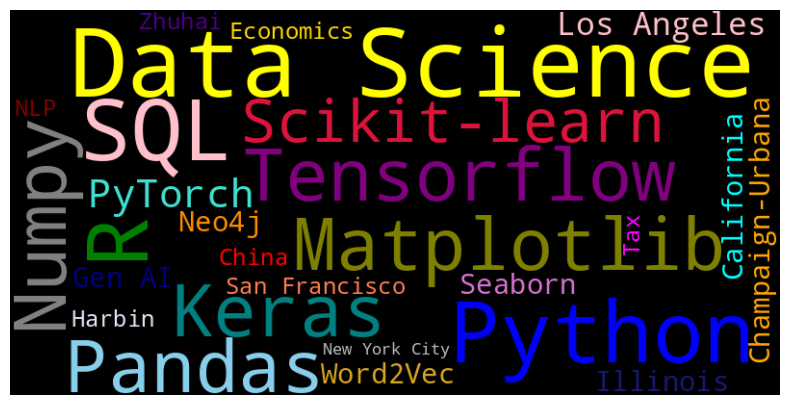

  
## Linkedin Profile

****

## Welcome to Wendy's Github Account 🌱 

Hey, you found me! This is Wendy, a lifelong explorer, currently diving into the field of Data Science. 

Here is a snapshot of me:

- Born and raised in China, studied in the U.S., worked in tax for a couple of years, and fell in love with Data Science.
- Pronouns: She/Her/Hers
- A curious, passionate, well-organized, and easy-going team player, with a lot of hobbies.
- A problem solver mostly code in Python, R, and SQL
- Hobbies: Yoga, spending a couple of hours in art museums, cooking clean and yummy (yes it's possible to achieve both) food, and reading novels.
- To learn, to cope, and to love ❤️
---
## <h3> Toolbox </h3>

---
## Projects 🔭

- 💼 Are we achieving WLB eventually? - A Descriptive Analysis of Working Hours on Age and Other Relevant Factors.
- 🍫 Rate Your Chocolate - A Multiclass Classification Problem with Logistic Regression Models
- 😊 Sentiment Detection on Tweets - A Binary Classification Problem on Text Data with CNN and RNN models 
-->
