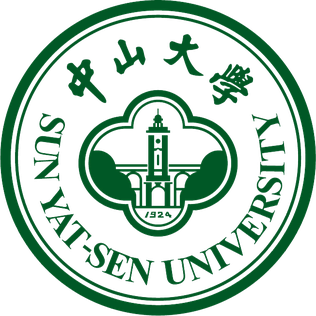

## Welcome to Wendy's Github Account 🌱 

  
Hi, you found me! I am a growing data scientist graduating from UC Berkeley in December 2025. My interest lies in implementing the agentic model framework in tax automation and the retrieval-based research engine in specialized topics.

Here is a snapshot of me:
- A curious, passionate, and collaborative problem-solver with a growing mindset
- Pronouns: She/Her/Hers
- Worked in US income tax for five years before pivoting to data science
- Mainly code in Python, R, and SQL
- Hobbies: Yoga, art museums, National Parks, and reading novels.
- To learn, to cope, and to love ❤️

---
## 🔭 Projects 

- 🤖 [AI Tax Research Assistant under RAG framework](https://github.com/Wendy0756/AI-Tax-Research-Assistant-under-RAG-Framework)
- 😊 [Content Attribution Detection on 1.6 Million Tweets](https://github.com/Wendy0756/Sentiment-Detection-Model-with-1D-CNN)
---
## 🎓 Education 
| Logo | School & Degree |
|------|-----------------|
|  | **University of California, Berkeley**  <small><em>Jan 2024 – Present</em></small> Master of Information and Data Science |
|  | **University of Southern California**  <small><em>Jun 2016 – May 2017</em></small> Master of Business Taxation |
|  | **University of Illinois at Urbana-Champaign**  <small><em>Aug 2013 – Dec 2015</em></small> Bachelor of Arts in Economics |
|  | **Sun Yat-sen University**  <small><em>Aug 2011 – May 2013</em></small> International Business School |

---
## 📧 Contact

---
---
## Toolbox

