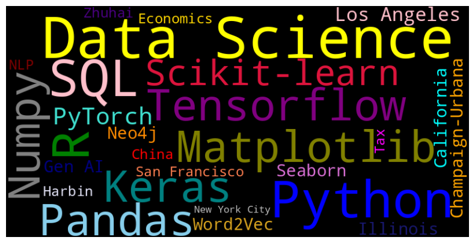

## LinkedIn Profile

****

## Welcome to Wendy's Github Account 🌱 

Hey, you found me! This is Wendy, a lifelong explorer, currently diving into the field of Data Science. 

Here is a snapshot of me:

- Born and raised in China, studied in the U.S., worked in US income tax for a couple of years, and found life love in my journey with Data Science.
- Pronouns: She/Her/Hers
- A curious, passionate, and collaborative problem-solver with a growing mindset
- Mainly code in Python, R, and SQL
- Hobbies: Yoga, art museums, National Parks, and reading novels.
- To learn, to cope, and to love ❤️
---
## <h3> Toolbox </h3>

---
## Projects 🔭

- 🤖 [AI Tax Research Assistant under RAG framework](https://github.com/Wendy0756/AI-Tax-Research-Assistant-under-RAG-Framework)
- 😊 [Content Attribution Detection on 1.6 Million Tweets](https://github.com/Wendy0756/Sentiment-Detection-Model-with-1D-CNN)
---
